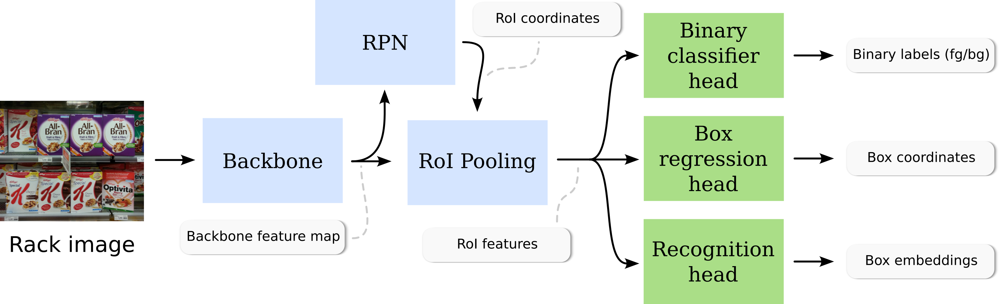
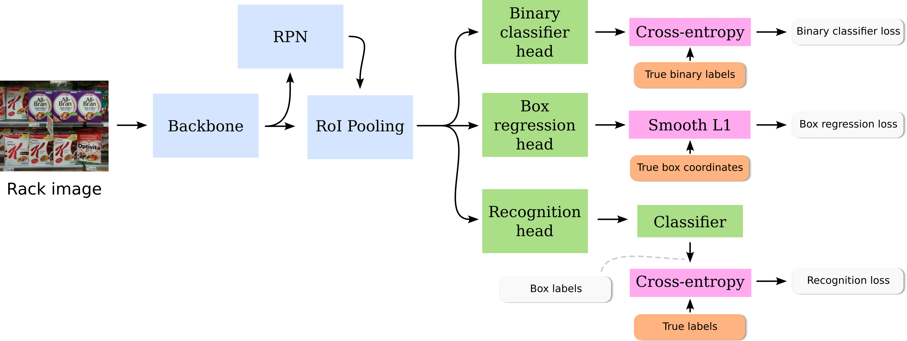
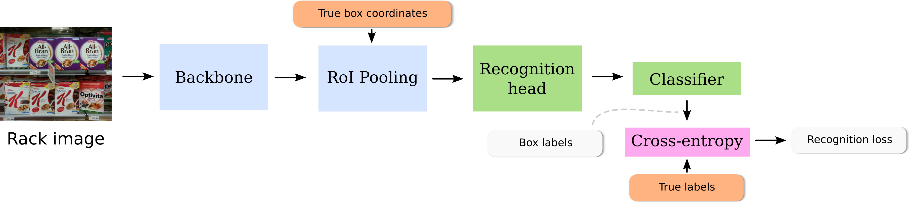
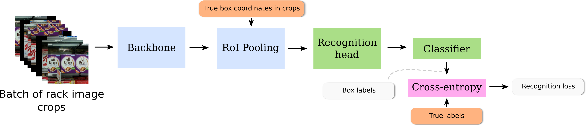
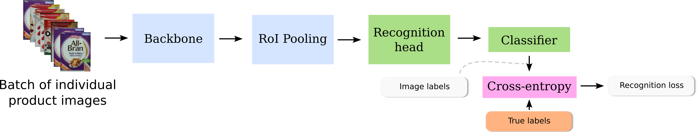

# Joint Training of Product Detection and Recognition using Task-Specific Datasets

This is the codebase used for our VISAPP 2023 submission (paper 189).

## Installing the project requirements

To install the project dependencies, run (preferably in a virtual environment)

```bash
pip install -r requirements.txt
```

We ran our experiments with Python 3.8.

We use [Weights and Biases](https://wandb.ai) for logging the results. You will need to create an account over there and run `wandb login` in your terminal. See <https://docs.wandb.ai/quickstart> for more information.

## Adding data

In our paper, we use the GroZi3.2k dataset [by George et al. (2014)](http://www.vs.inf.ethz.ch/publ/papers/mageorge_products_eccv2014.pdf) with annotations from [Tonioni and Di Stefano (2018)](https://arxiv.org/abs/1810.01733). This is also the default dataset that will be used when no `--dataset` is passed to `train.py` (see below). You can download the dataset [via this link](https://drive.google.com/file/d/1Dsje-fLMuVbt3k6cUUvxSte_mz4Cue6v/view?usp=sharing).

After extracting the `.tar.gz`-file, create a directory `data` in the root of the repository (if it doesn't exist yet) and move the extracted folder into it so that you'll have a folder `data/GroceryProducts_Tonioni`.

## Running a training

Trainings are run with the `train.py` script. You can get an overview and explanation of all CLI arguments by running:

```shell
python train.py --help
```

The trained architecture will always be the same (apart from the backbone, which can be configured via the CLI), i.e. a Faster-RCNN-like detector with a ResNet-based FPN backbone and an extra RoI head that returns recognition embeddings. During inference, it takes an image of a product rack as input and returns a set of bounding boxes, and for each bounding box a binary label (product/no product) and an embedding that can be used for product recognition.



As described in our paper, we propose 4 training procedures to investigate the feasibility of task-specific training. Below, we discuss how each of these procedures can be employed.

### Procedure 1: Conventional multi-class detector training



> The model is trained with a fully-annotated dataset. A batch of product rack images is passed through the joint architecture and we obtain a set of bounding boxes, binary class labels (foreground/background) and recognition embeddings (along with region proposals and objectness scores from the RPN). For each of these outputs, we have an annotated ground truth, so we can compute a loss value and train the network with a gradient descent-like optimization algorithm.

When no extra CLI arguments are present, `train.py` will use Procedure 1 by default. For example, to train a joint architecture with a ResNet50-FPN backbone:

```bash
python train.py --backbone_name=resnet50 --lr=0.01 --batch_size_det=2 --num_epochs=500 --wandb_entity=my_entity --wandb_project=my_project
```

Some words on the CLI arguments:

* `--backbone_name`: The name of the backbone network. You can also use `resnet18`, `resnet34` or `resnet101`.
* `--lr`: The learning rate.
* `--batch_size_det`: The batch size to use during training.
* `--num_epochs`: The number of epochs to train.
* `--wandb_entity`: The [Weights & Biases](https://wandb.ai) entity to send the training logs to. You'll need to create a WandB account first. See <https://docs.wandb.ai/quickstart>.
* `--wandb_project`: The project (within the WandB entity) to send the training logs to.

### Procedure 2: Two-phase training



> Unlike Procedure 1, the batch of rack images is passed through the joint architecture twice. Weight updates are applied after each training phase separately. During the detection training phase, the batch goes through all the network components, except the recognition head. Losses are computed for the RPN, bounding box regression and foreground/background classification. During the recognition training phase, the batch only goes through the backbone and the recognition head. We use the ground truth bounding boxes to apply RoI pooling on the feature maps that come out of the backbone. During this phase, only the recognition loss is computed. More specifcially, the loss is calculated from the ground-truth product label of the bounding box used during RoI pooling.

To apply Procedure 2, simply add the flag `--use_split_detect_recog` to the command. You should also set the batch size to use during recognition training. In our experiments, we always used the same batch size as for detection:

```bash
python train.py --use_split_detect_recog --backbone_name=resnet50 --lr=0.01 --batch_size_det=2 --batch_size_recog=2 --num_epochs=500 --wandb_entity=my_entity --wandb_project=my_project
```

### Procedure 3: Crop-batch training



> The detection training phase is the same as in Proc. 2, but during the recognition training phase, we use a batch of image crops as input, instead of the entire images. We again use the respective ground-truth bounding boxes of each crop in the batch to apply RoI pooling on the feature maps that are returned by the backbone.

To apply Procedure 3, add the flag `--use_crop_batch_inputs` to the command. You can use `--crop_box_size` to set the size of the crops. For example, if we want to use crops with a size of 300 pixels, enter something like:

```bash
python train.py --use_crop_batch_inputs --crop_box_size=300 --backbone_name=resnet50 --lr=0.01 --batch_size_det=2 --batch_size_recog=2 --num_epochs=500 --wandb_entity=my_entity --wandb_project=my_project
```

### Procedure 4: Task-specific training



> Again, the detection training phase is the same as in Proc. 2. The input of the recognition training phase, however, now consists of individual product images. RoI pooling is applied on the entire backbone feature map.

We treat Proc. 4 as a limit case of Proc. 3, i.e. when the crop box size is set to a size that is similar to the product sizes in the dataset.

### K-fold cross-validation

The `train.py` script will, by default, split up the dataset into 5 folds and use the first fold for validation. By changing which fold to use for validation, you can easily cross-validate your results. The fold to use for validation is set with `--k_fold_val_fold` (value from 0 to K - 1). You can also change the number of folds by setting `--k_fold_num_folds`.

For example, the following command will train a ResNet50-based joint architecture under Procedure 2 and will use fold index 4 for validation:

```bash
python train.py --use_split_detect_recog --k_fold_val_fold=4 --backbone_name=resnet50 --lr=0.01 --batch_size_det=2 --batch_size_recog=2 --num_epochs=500 --wandb_entity=my_entity --wandb_project=my_project
```

For cross-validation, however, we suggest you to use [WandB sweeps](https://docs.wandb.ai/guides/sweeps/quickstart) (see also further) to avoid error-prone and poorly maintainable manual CLI commands.

## Reproducing the paper results

The results reported in the paper can easily be reproduced by running the following command:

```bash
python run_sweeps.py sweeps/1_classic_detector_kfold.yaml sweeps/2_split_detect_recog_kfold.yaml sweeps/3_crop_batch_kfold.yaml
```

`run_sweeps.py` is a simple utility script that runs multiple [WandB sweeps](https://docs.wandb.ai/guides/sweeps/quickstart) consecutively. That way, you don't need to stay up to start the next sweep when one finishes in the middle of the night. 😉 The script takes in a list of YAML files, each of which configures another sweep.

* `sweeps/1_classic_detector_kfold.yaml` configures a 5-fold cross-validation for Procedure 1 training.
* `sweeps/2_split_detect_recog_kfold.yaml` configures a 5-fold cross-validation for Procedure 2 training.
* `sweeps/3_crop_batch_kfold.yaml` configures **four** 5-fold cross-validations for Procedure 3 training, i.e. for crop sizes 300, 400, 600 and 800 pixels.

The YAML files are rather self-explanatory (even more so after you have read [some of the WandB docs on Sweeps](https://docs.wandb.ai/guides/sweeps/quickstart#2.-configure-your-sweep)). **Make sure to update the `entity` (and, optionally, `project`) fields in each YAML file before using them.** The default values will not work, as this entity is private.

The graphs used in the paper are created by the notebook [`01_procedure_plots.ipynb`](./notebooks/03_training_procedure_experiments/01_procedure_plots.ipynb). To generate these graphs for your own experiments, you will need to change the `SWEEPS` dictionary and link your sweep slugs to the respective procedures (`PROC_1`, `PROC_2`, or `PROC_3`).

## Evaluation metrics

We log multiple validation metrics during training. These are summarized below.

| Metric | Explanation |
|-------------|-------------|
| `COCO_recog` (**COCO AP** in the paper) | The COCO APs (for multiple IoU thresholds) when the **product label** is used as class label and the confidence of the product classifier is used as confidence score. See [`coco_detection.py`](jpdr/metrics/coco_detection.py) for the source code. |
| `COCO_detect` (**COCO AP (binary clf)** in the paper) | The COCO APs (for multiple IoU thresholds) when the **binary label** (product/no product) is used as class label and the confidence of the binary classifier is used as confidence score. |
| `AggPRCurve` | For this metric, we crop the *ground-truth* products out of all validation query images and pass the crops through the backbone, apply RoI pooling to the *entire* feature map and compute a recognition embedding for each crop by passing the RoI embedding through the RoI recognition head. This recognition embedding is then passed through the classifier we used to compute the recognition loss during training. As such, we obtain a list of similarity scores. From these similarities, we can compute a binary PR-curve for each crop, from which we get the Average Precision, the maximum F1-score and the Precision, Recall and Threshold value at that F1-score. These metrics are summarized in WandB histograms. We also compute the average of all Average Precision values and log that as the mAP (also **mAP** in the paper). See [`agg_pr_curve.py`](jpdr/metrics/agg_pr_curve.py) for the source code. |
| `ProductMetrics` | Consists of three multi-label metrics. (1) *Product Precision*: For each validation image, the number of unique labels that were correctly predicted is divided by the total number of unique labels that were predicted. The Product Precision is obtained by calculating the mean over all images. (2) *Product Accuracy*: For each image, the intersection over union of the set of predicted labels and the set of true labels present in the image is calculated. The Product Accuracy is the mean of these IoUs over all images. This metric is sometimes also called *Mean average multi-label classification accuracy (mAMCA)*. (3) *Product Recall*: For each image, the number of unique labels that were correctly predicted is divided by the total number of ground truth unique labels. The Product Recall is obtained by calculating the mean over all images. |


The function `on_validation_step()` in [`training_steps.py`](training/training_steps/training_steps.py) calls two subroutines `on_valdation_step_recognition()` (which computes the `AggPRCurve` metrics) and `on_validation_step_detection()` (which computes the `COCO_recog`, `COCO_detect` and `ProductMetrics ` metrics).


## Running tests

We have written some unit tests to test that our metrics work as expected. You can run the tests with

```bash
python -m pytest tests
```
